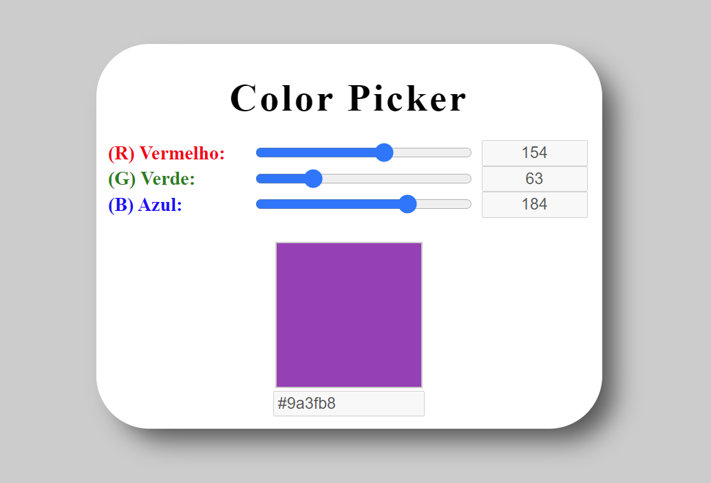

# :dart: Objetivos

Exercitar os seguintes conceitos trabalhados no Módulo:
<ul>
<li>Utilização de elementos HTML.</li>

<li>Utilização de CSS.</li><li>Utilização de identificadores em elementos HTML.</li>
<li>Captura de referência de elementos com JavaScript.</li>
<li>Manipulação de eventos com JavaScript.</li>
<li>Utilização de funções com JavaScript e CSS.</li>
<li>Manipulação direta de CSS com JavaScript.</li>
</ul>

## :triangular_flag_on_post: Desafio

:heavy_check_mark: <b>Desafio 01:</b> Construa, utilizando HTML, CSS e JavaScript puro, uma aplicação para a visualização de cores a partir da escala RGB.

# Color Picker Edit

